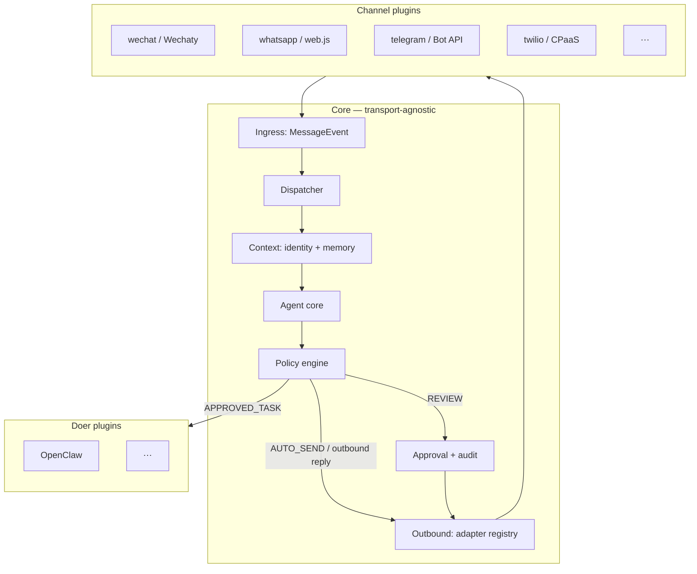

# System Design — Proxy Self / Delegate AI

**Product:** Proxy Self  
**Working name:** Delegate AI  
**Document type:** System design  
**Status:** Draft  
**Inputs:** `docs/PRD-MiraForU.md`, `docs/PRD-proxy-self-1-pager.md` (Twilio / CPaaS: Section 22)

---

## 1. Purpose

This document translates the PRD and one-pager into a production-oriented system design.

Core premise:

- This product is not just a chatbot.
- This product is not just automation.
- This product is a controlled delegation system.

The system must preserve:

- user identity
- user intent
- user boundaries
- user control

---

## 2. Product Model

The product combines two modes in one runtime:

- `AssistMode`: help the user think, rewrite, summarize, and choose a response.
- `DelegateMode`: draft or send on the user’s behalf under explicit policy.

Core loop:

```text
receive -> understand -> decide -> draft -> policy check -> send or approve
```

The system must optimize for:

- low cognitive load
- high trust
- identity consistency
- bounded autonomy

---

## 3. Primary Design Principles

### 3.1 Own the core, plug the edge

**Channel plugins** own only transport: normalize inbound events, send outbound commands. **Doer plugins** (e.g. **OpenClaw**) own only *approved* execution that goes beyond a single chat send. The **core** owns contracts, context, policy, identity, memory, approval, and audit.

| Surface | Outside (pluggable) | Inside (owned) |
| --- | --- | --- |
| Messaging | WeChat (Wechaty), WhatsApp (web.js or Twilio WA), Telegram, Twilio SMS/Conversations, future channels | `MessageEvent` / `OutboundCommand`, routing, policy |
| Execution | OpenClaw and other **doer runtimes** | Task boundary, approval, correlation ids, timeouts |
| Data / model | Hosted LLM, `vLLM`, managed Postgres/pgvector, auth providers | Schemas, retrieval, prompts orchestration |

See [Section 4](#4-plugin-architecture) and [Section 22](#22-twilio-and-managed-transport) for Twilio as a **channel plugin family**.

### 3.2 Channel SDKs live inside plugins only

Wechaty, Telegram, Twilio, and WhatsApp libraries exist only in **channel plugin** packages. They must not define product behavior in core.

### 3.3 Approval-first by default

Trust is the product constraint. The system starts in review-heavy mode and expands autonomy only through policy.

### 3.4 Transport is unreliable

The system must assume:

- sessions expire
- upstream protocols change
- bans happen
- reconnects fail

This is a product assumption, not an implementation detail.

### 3.5 Keep MVP infra intentionally lean

Prefer a single Node (or small set of) services and a managed database. Add **queues** (e.g. Postgres-backed jobs), Redis, and extra workers when load or reliability requires it—`MiraChat` already uses this pattern where deployed.

### 3.6 UX model: WhatsApp behavior, Instagram presentation

Product surfaces should separate **interaction model** from **visual language**:

- **Behave like WhatsApp:** conversation-first IA, recency-sorted inbox, thread-centric navigation, persistent composer, clear inbound/outbound semantics, strong mobile-first thread flow.
- **Look like Instagram DM:** dark editorial chrome, gradient accents, rounded pills, story-ring avatar affordances, softer glass-like surfaces, and less "admin dashboard" visual noise.

This affects system design because approval, policy, and metrics surfaces must be placed so they do not break the primary chat mental model.

---

### 3.7 Product surface architecture

The product should expose four user-facing surface types:

| Surface | Primary job | UX rule |
| --- | --- | --- |
| **Inbox / thread shell** | Main day-to-day messaging surface | Must feel like a familiar WhatsApp chat client first |
| **Inline approval surface** | Draft, approve, edit, reject, auto-queue | Must appear as an extension of the active thread, not a detached workflow app |
| **Secondary utility surfaces** | Settings, identity, relationship, audit | Use drawers, sheets, or modal layers so the thread remains the primary context |
| **Measurement dashboard** | PMF, trust, and research metrics | May be denser, but must still share the same visual tokens and brand system |

#### Layout requirements

- **Desktop:** left rail for inbox, right pane for the active conversation.
- **Mobile:** list view first, thread view second, with a clear back affordance.
- **Composer anchoring:** composer stays at the bottom of the active thread, with approval state immediately above it.
- **Search placement:** search belongs at the top of the inbox list, not hidden in settings.
- **Status placement:** connection, health, and mode indicators belong in the thread header as lightweight pills.

#### Visual-system requirements

- Reuse one shared token family for background, elevated panel, border, text, muted text, accent, danger, warning, and success states.
- Default to dark mode for messaging and dashboard surfaces.
- Use pill and capsule shapes for controls; avoid generic square admin buttons.
- Treat avatars as high-salience identity anchors; story-ring styling is preferred over flat circles.
- Use gradients sparingly but intentionally on primary actions and identity-signaling elements.

#### UI audit source of truth

The detailed inventory of current elements and their target treatment lives in [design-audit-proxy-self-ig-ui.md](./design-audit-proxy-self-ig-ui.md).

---

## 4. Plugin architecture

The product integrates the outside world through **two extension points**. Core code depends on **interfaces**, not on Wechaty, Telegram, Twilio, or OpenClaw types.

### 4.1 Channel plugins (messaging)

**Responsibility:** Inbound: map native SDK/webhook payloads → `MessageEvent`. Outbound: accept `OutboundCommand` → deliver on the right surface.

**Rules:**

- One **channel id** per registered plugin (e.g. `wechat`, `whatsapp`, `telegram`, `twilio_whatsapp`, `twilio_sms`).
- **No policy** inside the plugin—only normalization, session health, and send.
- **Stable addressing:** `threadId`, `senderId`, `accountId` are core-facing; mapping from vendor ids happens here.
- Optional `rawRef` on events for debug/replay only.

**Typical implementations (reference / planned):**

| Channel id | Upstream | Notes |
| --- | --- | --- |
| `wechat` | Wechaty + puppet | Personal WeChat; fragile sessions; distinct compliance |
| `whatsapp` | whatsapp-web.js | Unofficial client; dev/MVP path |
| `telegram` | Bot API (webhooks) | Bot-first; `chat.id` → `threadId` |
| `twilio_whatsapp` / `twilio_sms` | Twilio | Business API rules, templates, opt-in ([Section 22](#22-twilio-and-managed-transport)) |
| *extensible* | Slack, email, Signal, … | Same contracts; new adapter package |

Packages **`agent-core`**, **`assist-core`**, **`policy-engine`**, **`memory`**, **`identity`** stay **free of** channel SDK imports.

### 4.2 Doer plugins (execution runtime)

**Responsibility:** Run **approved** work that is **not** reducible to “post this text on channel X”—e.g. multi-step browser/tool flows driven by a separate agent process.

**OpenClaw** is the **reference doer plugin**: a **pluggable** runtime (local or hosted) invoked through a **narrow handoff API**. Core ships **no** embedded OpenClaw dependency; only a **contract** + optional adapter module.

**Conceptual interface:**

```ts
// Names illustrative; align with repo `adapter-types` / API as implemented.
interface DoerRuntime {
  readonly id: string // e.g. 'openclaw'
  execute(task: ApprovedDoerTask, ctx: DoerInvocationContext): Promise<DoerResult>
}
```

**`ApprovedDoerTask`** should include: bounded goal, allowlisted capabilities, timeout, correlation/audit ids, and routing hints—not full user identity graph.

**Ownership matrix:**

| Concern | Channel plugin | Doer plugin (e.g. OpenClaw) | Core |
| --- | --- | --- | --- |
| Source of truth for identity/relationship | — | — | yes |
| Policy & approval | — | — | yes |
| Draft generation | — | — | yes |
| Normalize / send chat messages | yes | — | routes commands |
| Tool/UI automation after approval | — | yes | — |

Doer failure must **not** weaken policy or skip audit; retries and partial state are reported back through core.

---

## 5. Canonical architecture

Single diagram: **channel plugins** and **doer plugins** attach at the edges; **core** stays in the middle.



---

## 6. Core runtime layers

### 6.1 Ingress

Accepts normalized **`MessageEvent`** from HTTP webhooks, long-running gateway processes, or queue consumers (`MiraChat` path), then hands off to the dispatcher.

### 6.2 Dispatcher

Resolves assist vs delegate mode, builds execution context, orchestrates agent + policy.

### 6.3 Agent core

Plan → execute → evaluate; output **`DelegateDraft`** (text, confidence, reasons, memory refs). Tool calls (e.g. scheduling) stay inside this layer until policy allows handoff to a **doer**.

### 6.4 Policy engine

Deterministic gates: **`AUTO_SEND`**, **`REVIEW`**, **`BLOCK`**, **`ESCALATE`**, and optional **`APPROVED_TASK`** when the approved next step is doer-owned.

### 6.5 Identity and relationship

Voice, boundaries, relationship graph, risk—loaded into context **before** generation.

### 6.6 Memory

Thread history, semantic recall, summaries; typically Postgres + pgvector (or equivalent).

### 6.7 Approval, audit, and doer handoff

- **Approval:** Human approve / edit / reject for drafts; capture edits for learning signals.
- **Audit:** Policy reason, correlation ids, timestamps.
- **Doer handoff:** Build **`ApprovedDoerTask`**, select **doer plugin** by id (`openclaw`, …), enforce timeout and allowlists. **No** OpenClaw types in core packages.

**Current repo sketch:** `MiraChat` implements channel ingress, Postgres-backed drafts, and workers; **OpenClaw** wires in as an optional **doer** behind this handoff boundary when enabled.

---

## 7. Control-Plane Contracts

All inbound and outbound flows must be normalized around transport-neutral contracts.

### 7.1 Inbound event

`channel` is an **extensible id** keyed to a registered **channel plugin**. Core types may enumerate known ids (`wechat`, `whatsapp`, `telegram`, `twilio_sms`, `twilio_whatsapp`, …) while allowing forward-compatible additions.

```ts
export type MessageEvent = {
  channel: ChannelId // plugin registry key; not closed to future channels
  accountId: string
  userId: string
  senderId: string
  threadId: string
  messageId: string
  text: string
  timestamp: number
  threadType: 'dm' | 'group'
  mentions?: string[]
  rawRef?: unknown
}
```

### 7.2 Adjacent contracts

- `AssistRequest`: user-authored prompt or selected message plus intent such as rewrite, summarize, or advise.
- `DelegateDraft`: candidate response plus mode, confidence, reasons, and memory references.
- `PolicyDecision`: `AUTO_SEND | REVIEW | BLOCK | ESCALATE` (plus optional **task** path for **doer** routing when product defines it).
- `ApprovalAction`: `APPROVE | EDIT | REJECT`.
- `OutboundCommand`: channel-neutral send command for text, media, forward, or delayed send (resolved by **channel plugin** via registry).
- `ApprovedDoerTask` / `DoerResult`: narrow **doer plugin** handoff (OpenClaw or alternatives); keep stable for audit.

### 7.3 Normalization rules

- Every gateway must emit the same `MessageEvent` shape.
- Group threads must use a stable room or group id as `threadId`.
- `senderId` must always identify the human sender, even in a group thread.
- Raw SDK objects may be kept only as `rawRef` for debug or replay.
- Core packages must never depend on SDK-native message objects.

---

## 8. Plugin registries

Core never imports channel or doer SDKs. It calls **registries** that map stable ids to implementations.

**Channel adapter registry**

```ts
registerChannelAdapter(adapter: ChannelAdapter): void
// Outbound: resolve adapter by OutboundCommand.channel and call send(command)
```

**Doer runtime registry**

```ts
registerDoerRuntime(runtime: DoerRuntime): void
// After approval: resolve by ApprovedDoerTask.doerId (e.g. 'openclaw') and execute(task, ctx)
```

**Twilio as nested plugins:** `gateway-twilio` may host an internal registry (Programmable Messaging vs Conversations) while exposing **one** channel id per product channel to core. Core keeps a single neutral `OutboundCommand`.

```ts
// Inside gateway-twilio only
const twilioPluginRegistry = {
  'programmable-messaging': programmableMessagingPlugin,
  conversations: twilioConversationsPlugin,
}
```

---

## 9. Channel plugin implementations

Gateway apps (`MiraChat/apps/`, etc.): upstream SDK → **`MessageEvent`** → core; outbound via **channel** registry.

### 9.1 `gateway-whatsapp`

- WhatsApp client (e.g. `whatsapp-web.js`): subscribe, normalize inbound, session/auth lifecycle.
- Emit `MessageEvent`; handle `OutboundCommand` for `channel: 'whatsapp'`.

### 9.2 `gateway-twilio` (CPaaS channel plugin — recommended Phase 1–2)

**Role:** Twilio is **transport + identity plumbing**, not the product. It provides messaging (SMS/MMS, WhatsApp Business API, Conversations API), voice, phone-based identity, OTP, global delivery, rate limiting, and much compliance surface area. It does **not** provide agent identity, approval UX, policy, conversation intelligence, or the trust layer for “AI acting on your behalf.”

`gateway-twilio` should be treated as a **plugin host**, not a monolithic Twilio wrapper. It owns:

- webhook ingress and signature validation
- normalized event emission into `MessageEvent`
- polling or callback orchestration against MiraChat tables
- plugin resolution for outbound Twilio delivery

Twilio product choices then become plugins behind a stable boundary, for example:

- `programmable-messaging` for SMS / WhatsApp sends
- `conversations` for threaded Twilio Conversations delivery
- provider-specific fallback or regional plugins later

**Responsibilities:**

- expose HTTPS webhooks for inbound messages (Conversations and/or WhatsApp Business)
- verify Twilio request signatures
- normalize Twilio payloads into `MessageEvent` (same contract as other gateways)
- route outbound through a Twilio transport plugin after policy and approval
- map Twilio conversation / participant identifiers to internal `threadId` and `senderId`

**Gateway-local plugin contract:**

```ts
interface TwilioTransportPlugin {
  id: string
  supports(channel: 'twilio_sms' | 'twilio_whatsapp'): boolean
  isConfigured(): boolean
  send(item: { threadId: string; text: string; channel: 'twilio_sms' | 'twilio_whatsapp' }): Promise<void>
}
```

This keeps Twilio-specific delivery code replaceable without rewriting webhook handling or MiraChat polling logic.

**Product choices:**

- **Prefer [Twilio Conversations API](https://www.twilio.com/docs/conversations)** for threaded chat, multi-party threads, and multi-device sync; it is a better fit than raw SMS for product UX.
- **Avoid raw SMS as the primary threading model** for conversational product UX (weak threading, poor inbox semantics).
- **WhatsApp Business via Twilio** is compliant but constrained: template rules, opt-in requirements, and “business” semantics—not a drop-in for personal WhatsApp identity.

**Compliance (do not hand-wave):**

- WhatsApp requires the **Business API** path; messages may require **templates**; users must **opt in**. Twilio does not exempt you from Meta’s rules.

**Flow (safe default):**

```text
Incoming message (Twilio webhook) → your app server → agent drafts reply → user approves (app UI) → Twilio sends message
```

**Optional low-risk automation** (policy-gated only), for example:

```json
{
  "intent": "acknowledgement",
  "confidence": ">0.9",
  "no_commitment": true
}
```

Align these gates with the policy engine outputs (`AUTO_SEND` vs `REVIEW`) in [Section 12](#12-policy-engine-design).

### 9.3 `gateway-telegram`

Telegram adapter for bot-first channels.

Responsibilities:

- verify webhook secret tokens when configured
- normalize inbound bot updates into `MessageEvent`
- poll approved drafts and send outbound text with the Bot API
- optionally self-register webhook URLs for controlled environments

Important Telegram-specific rules:

- use `chat.id` as `threadId`
- use `from.id` as `senderId`
- treat `private` chats as `dm`; everything else as `group`
- ignore non-text updates in MVP

### 9.4 `gateway-wechaty`

Later-stage WeChat adapter.

Responsibilities:

- instantiate Wechaty sessions
- listen to message, room, friendship, login, logout, scan, and error events
- normalize Wechaty `Message`, `Room`, and `Contact` objects
- send outbound messages via Wechaty objects

Important WeChat-specific rules:

- if `msg.room()` exists, set `threadType` to `group`
- use room id as `threadId` for groups
- keep `senderId` as `msg.talker().id`
- handle only text in early versions and preserve metadata for future media support

### 9.5 OpenClaw and other **doer** plugins

**Not a channel:** OpenClaw does not replace `MessageEvent` / `OutboundCommand`. It is an **execution plugin** invoked when policy and human approval say a **bounded task** may run outside the chat reply path.

- **Deploy** OpenClaw (or another `DoerRuntime`) as a separate process or sidecar; core calls it via HTTP/gRPC/queue with **`ApprovedDoerTask`** payloads only.
- **Register** with `doerId: 'openclaw'` (or versioned id) in the **doer registry**; core selects by policy output + user configuration.
- **Future doers** (headless browser farm, enterprise RPA, another agent stack) use the same interface—OpenClaw is the **reference** implementation, not a hard dependency in `agent-core`.

---

## 10. Modes

### 10.1 Assist mode

Used when the user is explicitly asking for help or when the system is operating in suggestion-only mode.

Typical capabilities:

- summarize thread
- generate reply options
- rewrite with different tones
- prepare negotiation language

### 10.2 Delegate mode

Used when the system is authorized to act on the user’s behalf.

Typical capabilities:

- generate a draft for approval
- handle routine conversations
- reply automatically only when policy explicitly allows

### 10.3 Approval model

Default actions:

- approve
- edit
- reject

The approval layer should capture edits and rejections for later learning and ranking.

---

## 11. Agent Core Design

The agent core should not be a single prompt wrapper. It should preserve a structured execution loop.

### 11.1 Planner

Tasks:

- classify intent
- determine whether this is assist or delegate work
- choose response strategy
- decide whether tools are needed

### 11.2 Executor

Tasks:

- retrieve context
- invoke domain tools when allowed
- produce candidate replies

### 11.3 Evaluator

Tasks:

- score confidence
- detect policy-sensitive content
- determine whether the result is safe enough to auto-send

### 11.4 Result shape

```ts
{
  output,
  confidence,
  rationale,
  mode,
  memoryRefs,
}
```

---

## 12. Policy Engine Design

The policy engine is the trust boundary and should be deterministic.

### 12.1 Default behavior

MVP default:

- route to `REVIEW` unless a policy explicitly says otherwise

### 12.2 Example policy rules

- financial commitments => `BLOCK`
- legal or irreversible actions => `BLOCK`
- low confidence => `REVIEW`
- low-risk routine domains with high confidence => `AUTO_SEND`
- contact-specific high-risk relationships => `REVIEW`
- quiet hours or timing rules => `REVIEW` or delayed send

### 12.3 Inputs

- channel
- relationship risk
- thread type
- confidence
- content sensitivity
- explicit user policies

### 12.4 Outputs

- `AUTO_SEND`
- `REVIEW`
- `BLOCK`
- `ESCALATE`

---

## 13. Identity and Relationship Model

This is a core moat. The product is valuable only if it can represent the user consistently.

### 13.1 Identity profile

Fields should include:

- communication style
- tone preferences
- boundaries and forbidden commitments
- goals or preferences for negotiation
- preferred pacing and level of directness

### 13.2 Relationship graph

Each relationship should capture:

- contact role such as boss, friend, partner, client
- tone preference
- risk tolerance
- do-not-say or do-not-commit rules
- prior interaction patterns

### 13.3 Identity injection

Identity and relationship state must be included in context before generation, not applied as a post-processing layer.

---

## 14. Memory Design

### 14.1 Storage choice

Use managed Postgres with `pgvector`, or Supabase backed by Postgres.

Do not build a custom vector store for MVP.

### 14.2 Core retrieval model

Context should combine:

- recent thread history
- semantic recall from prior relevant messages
- relationship and identity metadata

### 14.3 Initial schema

- `accounts`
- `contacts`
- `threads`
- `messages`
- `identity_profiles`
- `relationships`
- `drafts`
- `policy_events`
- `agent_runs`

### 14.4 Memory rules

- preserve enough history to explain decisions
- keep raw transport references for replay and debugging
- keep retrieval latency low enough to maintain a sub-2.5 second response target

---

## 15. Multi-User and Session Strategy

### 15.1 MVP strategy

Start with controlled multi-user support inside one Node service.

Model:

- in-memory session registry
- one or more channel sessions per connected user
- session-aware outbound routing

Why:

- minimal infra
- faster debugging
- fewer moving parts

### 15.2 Tradeoffs

- weaker isolation
- shared-process crash risk
- limited horizontal scalability

These are acceptable for MVP if approval-first and low user count are assumed.

### 15.3 Scale-up path

- add Redis for session and routing state
- add BullMQ or equivalent queue for async tasks
- split workers from gateway service
- isolate runtimes per account when reliability demands it

---

## 16. Lean Deployment Model

Recommended early deployment:

```text
Node.js core API (+ optional workers/queue)
├── Channel plugin processes: WhatsApp, Wechaty, Telegram, Twilio webhooks, …
├── Optional doer plugin: OpenClaw (separate runtime)
├── Dispatcher + agent core + policy
└── Postgres for memory / jobs
```

Not required in MVP:

- Kafka
- Kubernetes
- distributed worker pools
- per-session microservices

These should be introduced only when real operational pressure justifies them.

---

## 17. Reliability Model

The system must explicitly assume transport fragility.

Failure modes:

- session expiry
- reconnect failure
- upstream SDK breakage
- account restrictions or bans
- group-context ambiguity

Required mitigations:

- version pinning
- reconnect and backoff logic
- health checks
- raw event replay
- approval-first default
- channel isolation at the gateway boundary

For China-facing use cases, Wechaty should be treated as best-effort transport rather than guaranteed infrastructure.

---

## 18. Testing Strategy

### 18.1 Core testing

Core packages should be testable without any channel runtime.

Use synthetic fixtures:

```ts
await handleMessage({
  channel: 'wechat',
  accountId: 'acct-1',
  userId: 'user-1',
  senderId: 'contact-1',
  threadId: 'thread-1',
  messageId: 'msg-1',
  text: 'Hello',
  timestamp: Date.now(),
  threadType: 'dm',
})
```

### 18.2 Gateway testing

Gateways should be integration-tested separately as transport adapters.

### 18.3 Replay testing

Persist normalized events and use them for regression testing when upstream runtime behavior changes.

---

## 19. Observability

At minimum, emit structured events for:

- mode resolution
- policy decisions
- approval actions
- outbound sends
- runtime health and reconnects
- latency by stage

Important metrics:

- approval acceptance rate
- auto-send rate by policy class
- regret events
- end-to-end latency
- active conversations
- session failure rate

---

## 20. Phased Delivery

### Phase 0 — Prototype

- WhatsApp only (unofficial client **or** Twilio WhatsApp Business / Conversations, depending on compliance path)
- manual approval
- normalized message events
- single-service deployment

### Phase 1 — MVP

- **Twilio-first path (0 → 1):** SMS and/or WhatsApp via Twilio; invest in agent, approval UX, and policy engine—not in bespoke messaging infra
- dual-mode system
- identity injection
- memory and semantic recall
- approval UX
- managed Postgres

### Phase 2 — Trust and autonomy

- confidence scoring
- relationship graph
- tone adaptation
- limited auto-send
- approval learning loop

### Phase 3 — Expansion

- WeChat via Wechaty (where product and risk posture allow)
- **Hybrid transport:** keep Twilio (or other CPaaS) for external contacts; add internal or owned channels where it pays off
- multi-channel sync
- stronger policy engine
- optional Redis or queue (or Postgres-backed jobs where already adopted)

### Phase 4 — Advanced

- **Native / owned network (long-term):** full control, agent-native protocol, richer semantics than “plain text over CPaaS” (may include Matrix/Element-style or proprietary protocols)
- negotiation workflows
- voice and transcription (Twilio programmable voice can bootstrap; core still owns policy and approval)
- agent-to-agent interaction

**Strategic transport roadmap (summary):**

| Phase | Transport emphasis |
| ----- | ------------------- |
| 1 | Twilio (or similar CPaaS) for speed to market |
| 2 | Hybrid: CPaaS for externals + owned pieces where needed |
| 3 | Deeper native or decentralized messaging where that is the moat |

---

## 21. Non-Goals

Early versions should not attempt:

- fully autonomous open-ended conversations
- emotional companion behavior
- transport-specific business logic in core packages
- overbuilt distributed infra before product validation

---

## 22. Twilio and managed transport

Twilio is a **pragmatic** choice for early production if the team is crisp about **which layer it solves** versus what must remain in-house.

### 22.1 What Twilio gives you

Think of Twilio as **transport + identity plumbing**, not the product.

**Strengths**

- **Messaging APIs:** SMS/MMS, WhatsApp Business API, Conversations API (multi-party threads)
- **Voice:** programmable calls, IVR, speech
- **Identity:** phone-number-based identity; OTP / verification flows
- **Infra:** global delivery, rate limiting, substantial compliance and carrier plumbing handled upstream

**Not provided (core product problem)**

- Agent identity model (“voice of the user”)
- Approval / HITL UX
- Policy engine and trust boundaries
- Conversation intelligence and long-horizon memory strategy
- The **trust layer** for “AI acting on your behalf”

**Bottom line:** Twilio is **pipes**; the **brain + behavior** stay in your stack.

### 22.2 Where Twilio fits in the architecture

Twilio implements **channel plugins** (`twilio_sms`, `twilio_whatsapp`, Conversations-backed ids, etc.), not core logic:

```text
[ Channel clients ]
        ↓
[ gateway-twilio — channel plugin ]
        ↓
[ Core: agent + policy + memory + identity ]
        ↓
[ Outbound → same channel plugin ]
```

**Key idea:** Twilio is **transport** inside the **channel plugin** layer ([Section 4](#4-plugin-architecture)). The moat remains **policy + memory + identity + approval UX** (Sections [6](#6-core-runtime-layers)–[13](#13-identity-and-relationship-model)).

### 22.3 Production-oriented services (mapping)

These names align with how teams ship; map them to this document’s packages as needed.

1. **Conversation service** — threads, participants, message states (`draft` / `approved` / `sent`); overlaps with normalized events, drafts, and outbound tables in [Section 14](#14-memory-design).
2. **Agent service** — tone, memory, context, draft generation; overlaps with [Section 11](#11-agent-core-design) and memory/identity layers.
3. **Policy engine (critical)** — deterministic gates and autonomy bounds; overlaps with [Section 12](#12-policy-engine-design). Example policy fragment:

   ```json
   {
     "contact": "boss",
     "auto_send": false,
     "max_assertiveness": 0.3,
     "allowed_intents": ["inform", "ack"]
   }
   ```

4. **Delivery adapter (Twilio wrapper)** — implements the transport boundary behind **channel plugins** ([Section 8](#8-plugin-registries)); inside `gateway-twilio`, use a nested plugin registry so `programmable-messaging`, `conversations`, or future Twilio delivery modes swap without changing core policy code.

### 22.4 Twilio product choices

| Choice | Guidance |
| ------ | -------- |
| **Conversations API** | **Prefer** for chat threads, multi-device sync, and unifying WhatsApp + SMS-style channels where it fits the product. |
| **Raw SMS API** | **Avoid** as the primary threading model for conversational UX (weak threading, poorer product semantics). |
| **WhatsApp Business via Twilio** | **Optional** — compliant path, but template restrictions and opt-in rules apply; not equivalent to personal WhatsApp. |

### 22.5 Platform rules still apply

Even with Twilio, **you do not bypass platform rules**. For WhatsApp: Business API, templates where required, user opt-in, and Meta policy remain binding.

### 22.6 Mapping the “proxy agent” to Twilio

**Safe default flow**

```text
Incoming message (Twilio webhook) → your server → agent drafts → user approves (app) → Twilio sends
```

**Optional automation** only when policy explicitly allows (e.g. narrow intents, high confidence, no commitments)—see [Section 12](#12-policy-engine-design).

### 22.7 Where Twilio helps this product

1. **Cold start** — ship in weeks without building messaging infra; users reach you via SMS or WhatsApp.
2. **Identity simplicity** — phone number as a stable handle; less custom auth for some flows.
3. **Cross-channel unification** — one operational stack for SMS, WhatsApp, and later voice—consistent with a “communication OS” direction.

### 22.8 Limitations and exit criteria

1. **Cost at scale** — per-message economics can erode margin; plan a hybrid or native path before scale hits.
2. **UX ceilings** — limited control over typing indicators, delivery semantics, and channel-native nuances.
3. **No agent-native primitives** — everything is still “messages”; richer agent semantics live in **your** layers.
4. **Platform dependency** — WhatsApp policy changes, regional limits (e.g. China), carrier behavior.

### 22.9 Alternatives (serious options)

- **Vonage** — similar API surface; sometimes better regional economics.
- **MessageBird** — strong omnichannel; good EU coverage.
- **Matrix (Element) / open protocols** — decentralized, maximal control; closer to a long-term **native network** vision but higher build cost.

### 22.10 Recommendation

**Use Twilio (or equivalent CPaaS) when** you want to ship in **2–4 weeks**, validate PMF, and defer messaging infra.

**Do not treat Twilio as sufficient** if the goal is a **long-term messaging platform** with deep control over interaction models—in that case, plan Phases 3–4 toward hybrid and native or protocol-owned designs.

### 22.11 Build strategy (what actually differentiates)

Differentiation is **not** “we can send messages.”

Differentiation **is** **deciding what should be sent, when, and how**—under user boundaries and auditable policy.

---

## 23. Synthesis

The product is the **control layer**: identity, relationship-aware reasoning, memory, policy, and safe delegation—not any single chat SDK.

**Pluggable channel plugins** (WeChat, WhatsApp, Telegram, Twilio, …) provide **transport**. **Pluggable doer plugins** (OpenClaw first) provide **approved execution** beyond a single message send.

Posture:

- **Maximum leverage at the edge** — swap or add channels and doers without forking core.
- **Strong ownership in the core** — contracts, policy, audit.
- **Approval-first trust** — expand autonomy only through policy.
- **Minimal infra until proven necessary** — queue/scale when operational need is real.
